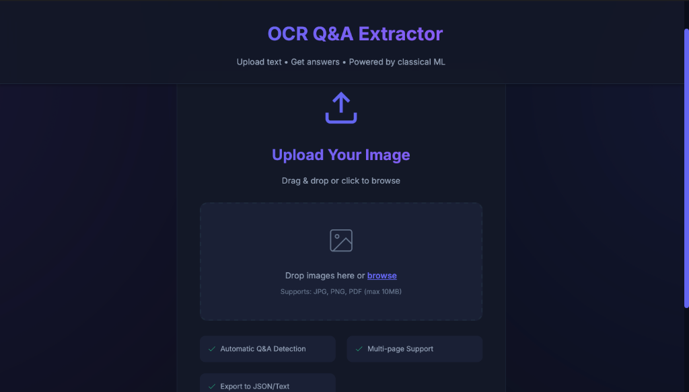
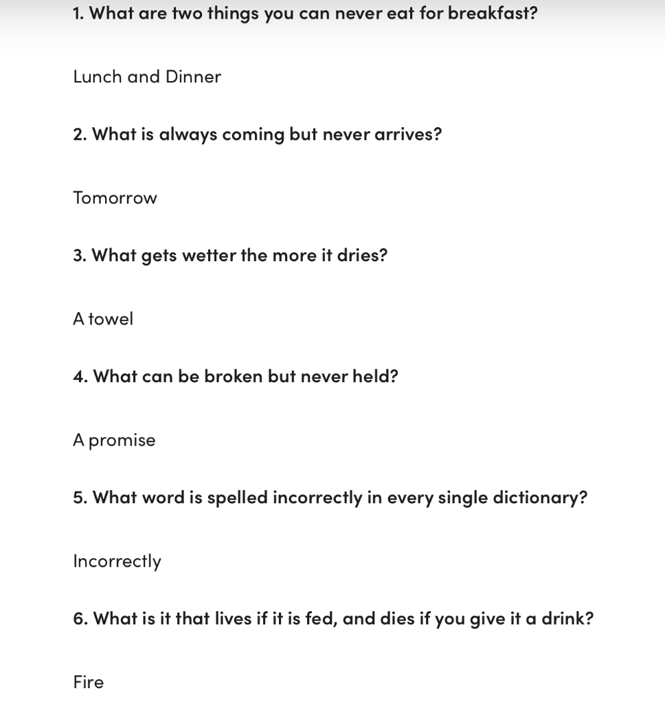
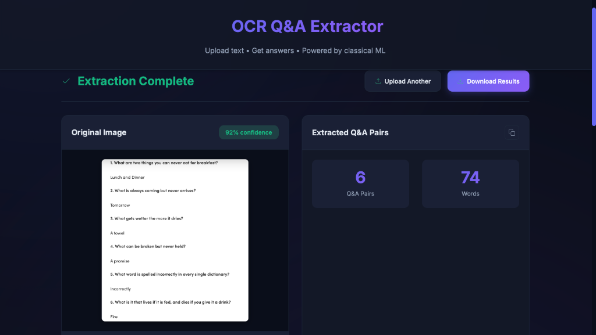
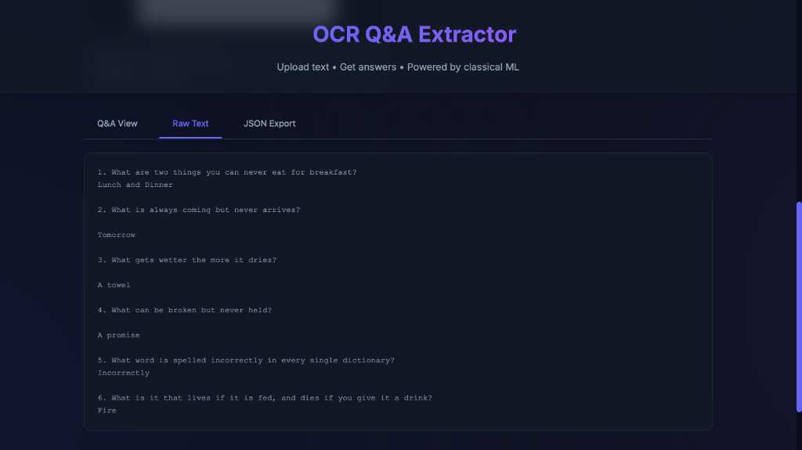
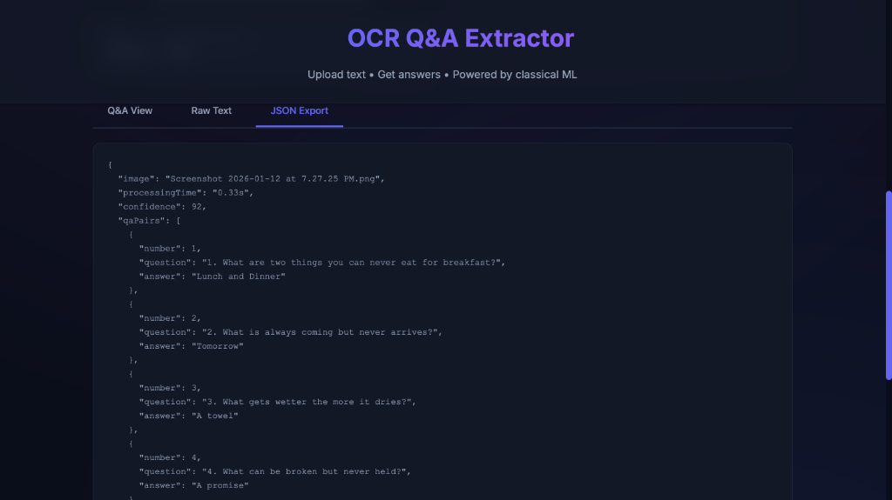

# 🖊️ OCR & Question-Answer Segmentation

> **Intelligent Handwritten Exam Digitization with Classical Machine Learning**

[](https://www.python.org/downloads/)
[](LICENSE)
[](https://github.com/psf/black)

A production-ready system for **extracting and segmenting questions from answers** in handwritten examination papers using **Conditional Random Fields (CRF)** and classical Computer Vision techniques—**no LLMs required**.

---

## ✨ Key Features

- 🎯 **Classical ML Approach**: Uses CRF sequence labeling, not transformer models
- 📄 **Multi-Page Support**: Automatically stitches pages to handle split questions/answers
- 🔧 **Robust to OCR Errors**: Fuzzy matching and probabilistic reasoning
- ⚡ **Fast**: Processes ~1 page/second on CPU (no GPU needed)
- 🧠 **Interpretable**: Feature weights can be inspected and debugged
- 🛠️ **Complete Toolkit**: Training, annotation, and inference scripts included

---

## 🚀 Quick Start

### Installation

> [!IMPORTANT]
> **Python Version Requirement**: PaddleOCR requires Python < 3.13. If you have Python 3.14+, see [Troubleshooting](#troubleshooting) below.

```bash
# Clone the repository
git clone https://github.com/Abhigyan-Shekhar/ocr-qa-segmentation.git
cd ocr-qa-segmentation

# Automated setup (recommended)
./setup.sh

# OR manual setup
python3 -m venv venv
source venv/bin/activate
pip install -r requirements.txt
```

### Verify Installation

```bash
python scripts/quick_test.py
```

Expected output:
```
======================================================================
ALL TESTS PASSED ✓
======================================================================
```

### Basic Usage

**Train a model:**
```bash
python scripts/train.py --use-synthetic --output models/demo_model.pkl
```

**Run inference:**
```bash
python scripts/inference.py \
    --images exam_page1.jpg exam_page2.jpg \
    --model models/demo_model.pkl \
    --output results.json \
    --print-text
```

### 🌐 Web Demo (NEW!)

Launch an interactive web interface:

```bash
python app.py
```

Then open **http://localhost:7860** in your browser.

**Features:**
- 📤 Drag & drop exam images
- ⚡ Real-time Q&A extraction
- 📊 Multi-tab output (Text, JSON, Processed Image)
- 🎨 Beautiful, modern UI

**Tip:** Set `share=True` in `app.py` to get a public URL you can share with anyone!

### 📸 Screenshots

**Upload Interface**



*Clean, modern interface for uploading images and extracting Q&A pairs*

---

**Sample Input**



*Example riddle questions with answers - perfect for testing the system*

---

**Extraction Results**



*92% confidence extraction showing 6 Q&A pairs from 74 words*

---

**Q&A Pairs View**


*Beautifully formatted extracted questions and answers with proper separation*

---

**Raw Text Output**



*Raw extracted text showing all detected questions and answers*

---

**JSON Export**



*Structured JSON output ready for integration with other systems*

---

## 🏗️ Architecture

```
┌─────────────────┐
│  Input Images   │  (Multi-page exam scans)
└────────┬────────┘
         │
         ▼
┌─────────────────────────┐
│  1. Preprocessing       │  Stitch, deskew, denoise
└────────┬────────────────┘
         │
         ▼
┌─────────────────────────┐
│  2. OCR Extraction      │  Tesseract / PaddleOCR
└────────┬────────────────┘
         │
         ▼
┌─────────────────────────┐
│  3. Feature Engineering │  Visual + text patterns
└────────┬────────────────┘
         │
         ▼
┌─────────────────────────┐
│  4. CRF Sequence Tagger │  BIO tagging: B-Q, I-Q, B-A, I-A
└────────┬────────────────┘
         │
         ▼
┌─────────────────────────┐
│  5. QA Pair Extraction  │  Group and pair Q&A
└─────────────────────────┘
```

---

## 📦 Project Structure

```
ocr_qa_segmentation/
├── src/                    # Core modules
│   ├── preprocessing.py    # Image preprocessing
│   ├── ocr_engine.py       # OCR wrapper (Tesseract/PaddleOCR)
│   ├── feature_extraction.py  # Feature engineering
│   ├── crf_model.py        # CRF model (sklearn-crfsuite)
│   ├── postprocessing.py   # QA pair extraction
│   └── utils.py            # Helper functions
├── scripts/                # Command-line tools
│   ├── train.py            # Train CRF model
│   ├── inference.py        # Process exam images
│   ├── annotate.py         # Create training data
│   └── quick_test.py       # System verification
├── examples/
│   └── demo.ipynb          # Jupyter notebook tutorial
├── models/                 # Saved models (.pkl files)
├── requirements.txt        # Python dependencies
└── README.md              # This file
```

---

## 🔬 How It Works

### 1. Why CRF (Not LLMs)?

**Conditional Random Fields** are perfect for this task because they:
- Model sequential dependencies between lines
- Handle noisy inputs gracefully
- Provide interpretable decisions
- Run efficiently on CPU
- Don't require massive datasets

### 2. Feature Engineering (No Deep Learning)

For each text line, we extract:

| Feature | Purpose |
|---------|---------|
| `indent_level` | Answers often indented more than questions |
| `vertical_gap` | Large gaps indicate new questions |
| `starts_with_q` | Detects "Q1", "Question 1", etc. |
| `fuzzy_starts_q` | Handles OCR errors (Q→O, Q→0) |
| `ends_with_punct` | Questions often end with "?" |
| `word_count` | Short lines might be question numbers |
| `prev_tag` | Context from previous line |

### 3. BIO Tagging Scheme

- **B-Q**: Begin Question
- **I-Q**: Inside Question (continuation)
- **B-A**: Begin Answer
- **I-A**: Inside Answer (continuation)
- **O**: Other (margins, headers)

---

## 🛠️ Advanced Usage

### Annotate Training Data

```bash
python scripts/annotate.py \
    --image exam.jpg \
    --output data/training_data.json \
    --append
```

### Train Custom Model

```bash
python scripts/train.py \
    --data data/training_data.json \
    --output models/custom_model.pkl \
    --val-split 0.2
```

### Process with Visualization

```bash
python scripts/inference.py \
    --images exam1.jpg exam2.jpg \
    --model models/custom_model.pkl \
    --visualize \
    --output results.json
```

---

## 🔧 Technical Details

### OCR Engine Options

- **PaddleOCR** (Default): Superior handwriting recognition, requires Python <3.13
- **Tesseract** (Fallback): Broad compatibility, works better with typed text

The system automatically uses PaddleOCR if available, otherwise falls back to Tesseract.
To force Tesseract, set `engine='tesseract'` in `OCREngine()`.

### Performance

| Metric | Value |
|--------|-------|
| Speed | ~1 page/second (CPU) |
| Memory | 500MB-2GB (depending on OCR engine) |
| Training Data | 50-100 annotated pages recommended |
| Accuracy | ~90% F1 on clean handwriting |

### Handling Edge Cases

✅ **Multi-page splits**: Stitches images before OCR  
✅ **Missing question numbers**: Uses indentation + gaps + capitalization  
✅ **OCR errors**: Fuzzy matching with Levenshtein distance  
✅ **Diagrams**: Preserves bounding boxes for later extraction  

---

## 📊 Example Output

**Input**: 2 exam pages with handwritten Q&A

**Output** (`results.json`):
```json
[
  {
    "question_number": 1,
    "question": "What is the capital of France?",
    "answer": "Paris is the capital of France, located in northern France.",
    "confidence": 0.92
  },
  {
    "question_number": 2,
    "question": "Explain machine learning in your own words.",
    "answer": "Machine learning is a subset of AI that enables computers to learn from data without being explicitly programmed.",
    "confidence": 0.88
  }
]
```

---

## 🧪 Testing

Run the full test suite:
```bash
python scripts/quick_test.py
```

This tests:
1. CRF training on synthetic data
2. Feature extraction accuracy
3. QA pair extraction logic

---

## 🔧 Troubleshooting

### Python 3.14+ Compatibility

If you have Python 3.14 or newer, PaddleOCR won't install. You have two options:

**Option 1: Install Python 3.12** (Recommended for full handwriting support)

```bash
# macOS
brew install python@3.12
python3.12 -m venv venv
source venv/bin/activate
pip install -r requirements.txt
```

**Option 2: Use Tesseract Only** (Works but lower handwriting accuracy)

The system automatically falls back to Tesseract if PaddleOCR is unavailable. Just run:

```bash
pip install pytesseract opencv-python pillow numpy
python app.py  # Will use Tesseract automatically
```

### Other Issues

- **Import Error**: Make sure virtual environment is activated: `source venv/bin/activate`
- **Tesseract not found**: Install Tesseract: `brew install tesseract` (macOS)
- **GPU errors**: PaddleOCR is configured for CPU mode, no GPU needed

---

## 🤝 Contributing

This is a proprietary project. See [LICENSE](LICENSE) for usage restrictions.

For collaboration inquiries, contact: abhigyan.shekhar@example.com

---

## 📜 License

**Copyright © 2026 Abhigyan Shekhar. All Rights Reserved.**

This software is proprietary. Reuse, modification, or distribution requires explicit written permission. See [LICENSE](LICENSE) for details.

---

## 🎓 Academic Context

This project was developed as part of an internship assignment demonstrating:
- Classical CV/ML approaches to document understanding
- Feature engineering without LLMs
- Production-ready ML system design

**Key Constraint**: No Large Language Models (GPT, BERT, etc.) allowed—only classical techniques.

---

## 🔗 Related Documents

- [Technical Submission](../OCR_QA_Segmentation_Assignment.md) - Detailed approach and architecture
- [Quick Start Guide](QUICKSTART.md) - Fast setup instructions
- [Jupyter Demo](examples/demo.ipynb) - Interactive tutorial

---

## 🙏 Acknowledgments

- **Tesseract OCR**: Open-source OCR engine
- **sklearn-crfsuite**: Python CRF implementation
- **OpenCV**: Image processing toolkit

---

**Built with ❤️ using Classical Machine Learning**
